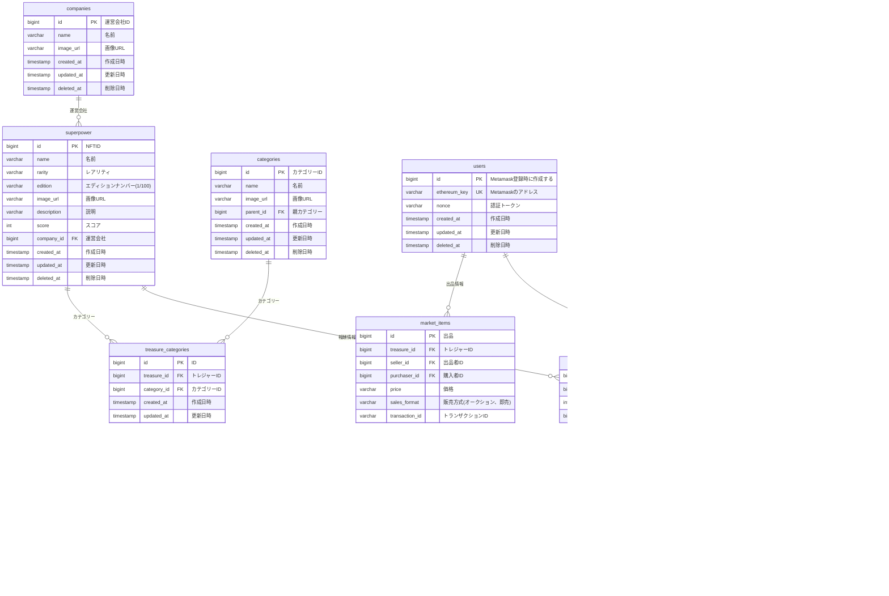

# 全体

- マーケットプレイス
  - 買い手と売り手と金額の決定はWeb2で行いバックエンドの操作用アドレスでMarketplaceContractを操作する
  - MarketplaceContractはThirdwebWallet間でのSuperpowerの所有権の移転とAsterの移動を行う
- ThirdwebWallet
  - Thirdwebの組み込みウォレット
  - 操作用アドレスに対して所有するSuperpowerをApproveする
- Superpower
  - ERC721Royaltyを継承
    - ERC2981準拠
  - receiverとして運営用アドレスを設定
- 運営用アドレス
  - 人間が管理する
- 操作用アドレス
  - バックエンドが利用する
  - 鍵はKMSで管理

# Database

