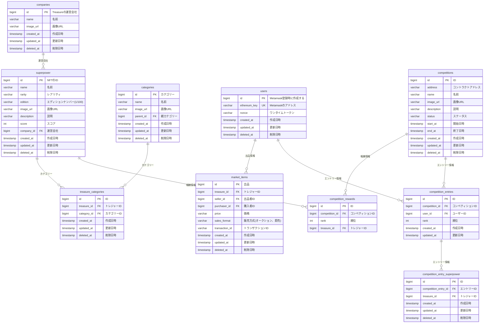

# ER図

- Superpowerコントラクト
  - ERC721Royaltyを継承
    - ERC2981準拠
  - receiverとして運営用アドレスを設定
- デポジット用コントラクト
  - ユーザーごとにウォレットを作成
  - マネーロンダリング対策
    - 出金時にマルチシグ承認を挟む
- マーケットプレイスコントラクト
  - 購入者と出品者のマッピングはオフチェーン
  - 所有権の移転はオンチェーン(transferHoge)
    - 手数料を運営用コントラクトに送る
    - バックエンドからのみ呼び出し可能
- 操作用アドレス
    - バックエンドのサービスが使うアドレス
- 運営用アドレス
  - 手数料を受け取る
  - Superpowerの発行/譲渡

- 気になること
- 

- メタマスク認証の仕組み
- 法人(事業者)で管理するアドレス
- 
